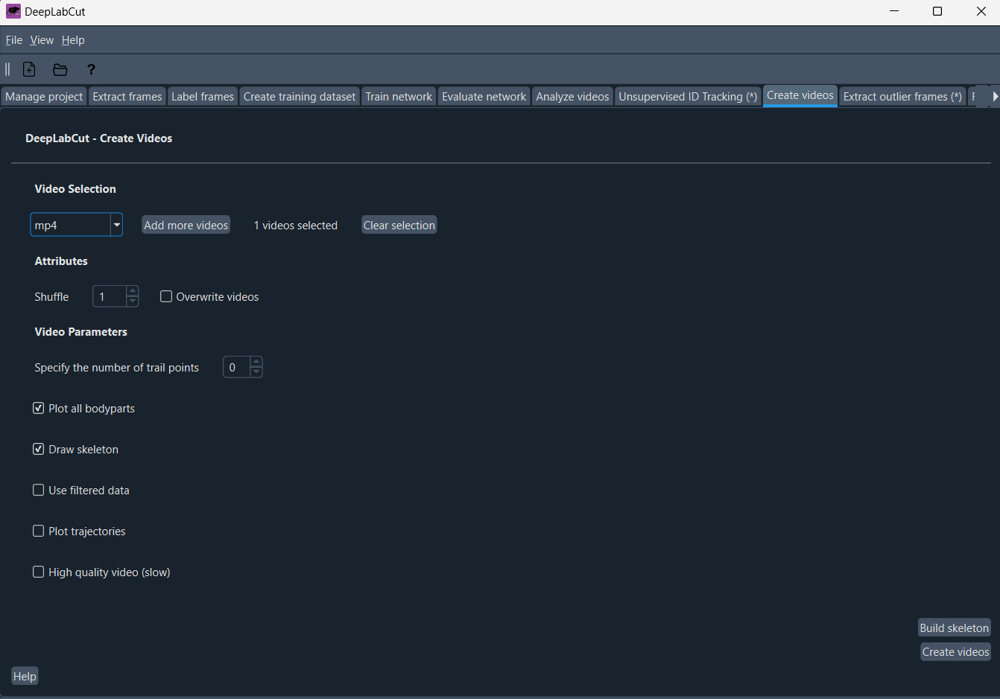
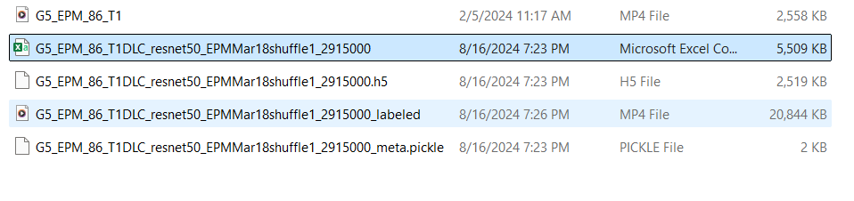
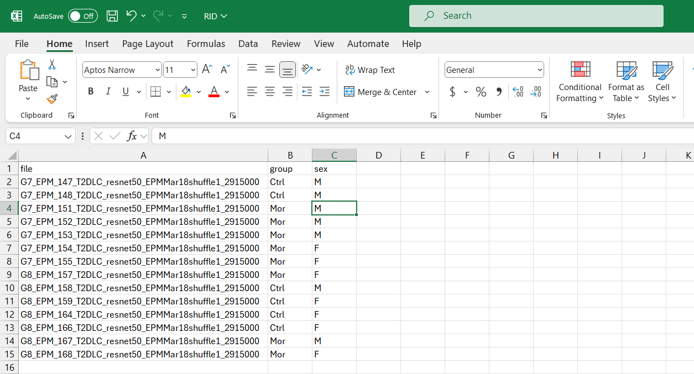

# Behavior analysis tutorial

Another short tutorial of HOW TO NEUROPSYTOX:

- [Behavior analysis tutorial](#behavior-analysis-tutorial)
- [Installation](#installation)
    - [DeepLabCut (already installed in laboratory laptops)](#deeplabcut-already-installed-in-laboratory-laptops)
- [Running DLC for animal tracking](#running-dlc-for-animal-tracking)
  - [DeepLabCut to analyze videos of EPM or NOR](#deeplabcut-to-analyze-videos-of-epm-or-nor)
    - [Re-train your network](#re-train-your-network)
- [Behavior metrics](#behavior-metrics)
    - [Using the shiny app to run DLCAnalyzer scripts](#using-the-shiny-app-to-run-dlcanalyzer-scripts)
- [Assistent watchers to create ethograms](#assistent-watchers-to-create-ethograms)
  - [Using BORIS](#using-boris)
- [Discovering behaviors (pose + frame networks)](#discovering-behaviors-pose--frame-networks)

# Installation 

### DeepLabCut (already installed in laboratory laptops)

1. By hand:
   1. Install Python 3.7 or higher.
   2. Install DeepLabCut using pip: `pip install deeplabcut[gui]`.
2. Through anaconda yalm file
   1. Install anaconda environments
   2. Create a new environment: conda create -n my_env python=3.7.
   3. Activate the environment: conda activate my_env.
   4. Install DeepLabCut using conda: conda install -c conda-forge deeplabcut.
   5. Install additional dependencies: pip install deeplabcut[gui].
   6. Verify the installation: deeplabcut check-requirements.

   
   7. Install anaconda environments
   
   8. git clone https://github.com/DeepLabCut/DeepLabCut.git or download as a zip file
   9. Open the Anaconda Navigator
   10. Select the yalm file and install it 
   
   11. After installing, run ipython terminal
   
   12. Run:
       1.  Import deeplabcut
       2.  Run deeplabcut.launch()
   
   13. Open DLC gui
   

**Links** 📖:
https://deeplabcut.github.io/DeepLabCut/docs/installation.html

# Running DLC for animal tracking
## DeepLabCut to analyze videos of EPM or NOR

1. Import library `import deeplabcut`
2. Launch the gui: `deeplabcut.launch_dlc()`
   
3. Open the config file with `Load project`
   1. EPM
   
   2. NOR
   

4. To analyze videos, first you must have your videos cropped and/or with a compression (reduce the resolution)
   1. If not, use the DLC tool
   
   
   
   2. Just click crop as many videos you have 
   3. Also, you can rotate or flip your videos
   4. If is borring to click, you can do it with a script by using ffmpeg (-crf to adjust the resolution, higher is low res):
    `ffmpeg -i input.mp4 -vcodec libx265 -crf 28 input_cropped.mp4`
5. You can now analyze your videos with just one-click, remember to allow the save as csv option
   
6. You can see the progress on the terminal
   
7. For quality control, is highly recommendable to view some videos of each batch to be sure that the network is predicting your animal (mouse or rat) pose and the maze. To do that, just click on create videos tab and in the button.
   
8. Your animals are tracked! You can work with the coordinates in the best way you want to (see Behavior metrics or Discovering behaviors).
   
9. You will have 3 more files:
   1.  coordinates csv
   2.  python datafile (h5)
   3.  python metadata
   
   

### Re-train your network
If the pose DLC or NOR -network is doing a terrible job to tracking, you can re-train it using your own videos. 

1. Use a few videos to re-train (maybe 4 per recording conditions).
2. You have to re-label, in total would be 5 frames per video.
3. Extracting outliers.
4. Re-label.
5. Re-training the network
6. Analyze and quality control (See above section)

# Behavior metrics
### Using the shiny app to run DLCAnalyzer scripts
Please read the [paper](https://www.nature.com/articles/s41386-020-0776-y) and check the github repository: https://github.com/ETHZ-INS/DLCAnalyzer

Based on those scripts i built a quick shiny app to run the scripts by GUI

1. Open RStudio
   
2. Load the app file
   
3. Just run the app
   
4. It will open the GUI
   
5. Fill the inputs
6. Add the input directory, the files are the coordinates in csv obtained by DLC
   
7. Load the zoneinfo file from EPM or NOR
   
8. Fill the frames of your videos, all csv files must have been obtained from videos with the same fps, you can check it by see the videos details
   
9. Fill the options, you can allow the export option to create the excel table
   
10. Metrics are ready for each csv file!
   
   
11. You can explore the metrics based on demographics, just upload it and click submit
   
    1.  The first column must be each csv filename, with "file" as first row
    2.  The rest could be as you want
        
12. You will see the same table as before, but now, in the graph tab you can create different visualization of the metrics and demographics, select the Y,X,Z that you're interested.
   
13. At the end, you will have the indexes file with all basic DLCAnalyzer metrics
   

# Assistent watchers to create ethograms
## Using BORIS

# Discovering behaviors (pose + frame networks)

